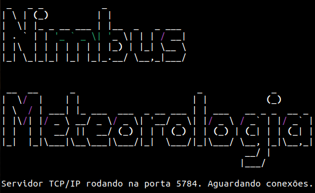
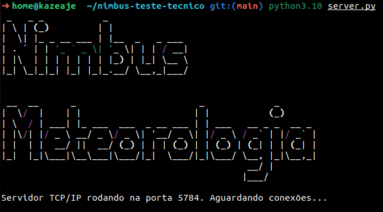

---

# Nimbus Meteorologia - Teste Técnico Python PL

## Geral
Este repositório tem duas aplicações Python como parte do teste técnico da Nimbus. As aplicações são projetadas para lidar com a recepção contínua de dados e geração de relatórios com base em informações meteorológicas. O projeto utiliza comunicação TCP/IP para recepção de dados e geração de relatórios meteorológicos em formato PDF, que também podem ser enviados por e-mail de forma automática.

## Tabela de Conteúdo
- [Geral](#Geral)
- [Features](#features)
- [Tecnologias](#tecnologias)
- [Instruções](#instruções)
- [Executando aplicações](#executando-aplicações)
  - [Applicação 1: Serviço Continuo de Receptação de Dados](#applicação-1-serviço-continuo-de-receptação-de-dados)
  - [Applicação 2: Gerador de Relatório Meteorológico](#applicação-2-gerador-de-relatório-meteorológico)
- [Contato](#contato)

## Features

### 1. Serviço Continuo de Receptação de Dados
- **Execução Contínua** até a interrupção manual.
- **Recebe dados** via TCP/IP na porta 5784.
- **Validação dos Dados** formato: `name,email,phone,age`.
- **Armazena os dados recebidos** localmente (em um arquivo de texto).
- **Resposta com "OK"** após o recebimento bem-sucedido de dados ou uma mensagem de erro se os dados forem inválidos.

### 2. Gerador de Relatório Meteorológico
- **Gera relatórios meteorológicos em PDF** com base em parâmetros de entrada, como número(s) de telefone, data e caminho para um arquivo de dados brutos.
- **Suporta formatação dinâmica de relatórios** com base em diferentes fenômenos meteorológicos.
- **Envia relatórios por e-mail** se o parâmetro `--send_email` estiver presente no comando.
- **Registra todas as atividades** usando uma biblioteca de registro de logs `logging`.

## Tecnologias
- **Python 3.10.x**
- **Biblioteca** `Socket` TCP/IP
- **Biblioteca de geração de PDF** `fpdf`
- **Biblioteca nativa de e-mail** `smtplib`
- **Biblioteca nativa de logs** módulo `logging` do Python)

## Instruções

### Clonar Repositorio
```
$ git clone https://github.com/wamauri/nimbus-teste-tecnico.git
```
```
$ cd nimbus-teste-tecnico
```

### Instalação de  Dependencias

```
$ python3.10 -m pip install -r requirements.txt
```

## Executando aplicações

### Applicação 1: Serviço Continuo de Receptação de Dados
1. **Inicie o servidor**:
   ```
   $ python3.10 server.py
   ```
   
   
   Esse comando iniciará o servidor TCP/IP na porta 5784 e o manterá em execução continuamente e pronto para receber dados.

   ## **Enviando dados para o server**:

   Para conectar e enviar dados para o servidor abra um terminal em outra aba ou janela e utilize uma ferramenta de conexão TCP/IP de sua preferência.
   Aqui estão exemplos de como utlizar.
   
   ```
   $ netcat localhost 5784
   name,email,phone,age
   Ok
   ```
   ou
   ```
   $ telnet localhost 5784
   ```
   ou
   ```
   $ curl telnet://localhost:5784
   ```


2. **Parando o servidor**:

   Execute um comando de parada explícito, como `ctrl + c`, ou encerre o processo manualmente.

### Applicação 2: Gerador de Relatório Meteorológico
1. **Gere um relatório** executando o script com os parâmetros apropriados:
   ```bash
   python3.10 generate_report.py --phone "01234567891" --date "2024-01-01T00:00" --file "bruto.txt" --send_email
   ```
   > o arquivo bruto.txt precisa estar na pasta raiz do projeto que a a pasta `nimbus-teste-tecnico`

   Esse comando gerará um relatório em PDF e o enviará por e-mail se a flag `--send_email` estiver presente no comando.

---
   **Configurando o email**:

   As constantes para a configuração de autenticação para o envio de email está no arquivo: `services/email.py`
   ```
   SMTP_SERVER = 'smtp.gmail.com'
   SMTP_PORT = 587
   USERNAME = 'wamauri10@gmail.com'
   PASSWORD = 'ajtv bwaz yqhg wmyi'
   ```
   As constantes para a configuração do assunto e do corpo do email está no arquivo: `generate_report.py`
   ```
   SUBJECT = 'Relatório Meteorológico'
   BODY = f'Olá.\n\nSegue em anexo o relatório meteorológico\n\nHavendo dúvidas, por favor, entre em contato.'
   ```

2. **Output**:
   - O relatório em PDF será gerado e salvo na pasta reports .
   - Os logs serão salvos nos arquivos `server.log` e `generate_report.log` na pasta do projeto.

## Contato

Para quaisquer dúvidas ou problemas, entre em contato através de [amaurisantospro@gmail.com](mailto:amaurisantospro@gmail.com).
